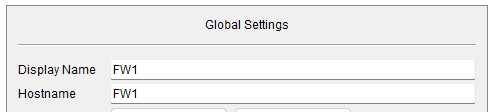
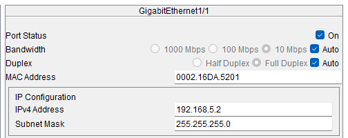
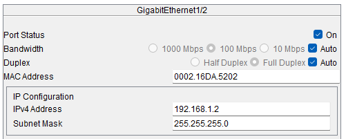

# Configuration file for Firewall FW1

## Steps to configure FW1

### Change the name

### Disable domain lookup (search for a command)
Not able to do this on firewall, desactivated by default

### Add ip to interfaces

### Add static route

## Running config