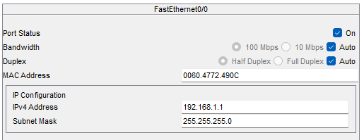

# Configuration file for Router R1

## Steps to configure R1

### Change the name

### Disable domain lookup (search for a command)

### Add ip to interfaces

> [!CAUTION]
> Don't forget to turn on the interface

Shutdown unused interfaces

### Add static route

## Running config