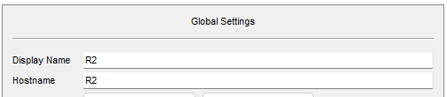
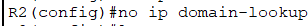
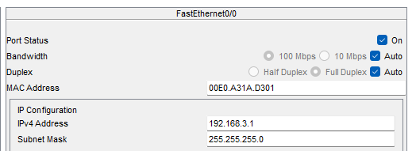
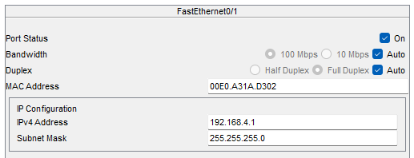
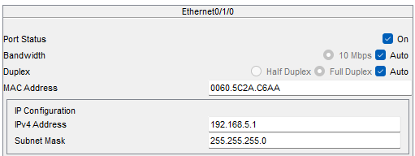
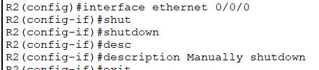

# Configuration file for Router R2

## Steps to configure R2

### Change the name

### Disable domain lookup (search for a command)

### Add ip to interfaces

Shutdown manually the unused interface

### Add static route

## Running config