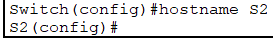
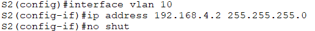
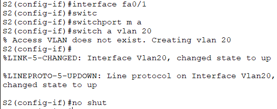
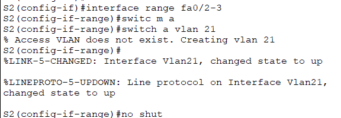
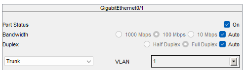
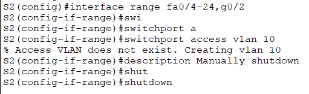
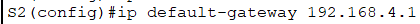

# Configuration file for Switch S2

## Steps to configure S2

### Change the name

### Add ip to VLANs

### Add VLANs to interfaces

### Setup trunk interface

### Shutdown unused ports

### Add gateway

## Running config